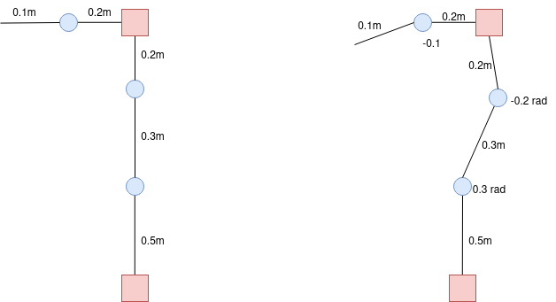

# Contents

Here can be found couple exersises regarding [KDL](https://www.orocos.org/kdl.html) and [Eigen](https://eigen.tuxfamily.org/index.php?title=Main_Page). This part is meant to be light introduction to programming linear algebra with C++ and how to utilize KDL to use kinematics and dynamic solvers.


## Exercise 1

There is a robotic manipulator that has 2 degrees of freedom. Calculate the end effector pose both using KDL and Eigen. In the the image the blue joints are revolionary joints and red ones are fixed joints at 90 degrees. 

Try to create both examples where joints are default pose (0 rad) and where there is some rotation applied to each joint with KDL and Eigen (see the image below). Try to also access the data from each data structure and see if you can parse the position data and orientation data. 



You can find corresponding files where you can implement you solution in the src file.

for eigen:
[Eigen example template](/src/eigen.cpp)


for KDL:
[KDL example template](/src/kdl.cpp)


to run these examples run following commands:

```
catkin build
```


```
rosrun eigen_kdl_examples kdl
```

```
rosrun eigen_kdl_examples eigen
```

You can also make your own package and make your scripts there!

## Exercise 2 questions

What is the matrix order in eigen?

What other useful solver does KDL contain?

You can check the arm controllers pkg and open for example computed_torque_controller.cpp and try to find what could be useful solvers during this course.

## Exercise 3 questions

Get more familiar with the arm controllers.

How do they work?

* Where is the main control loop?

* How is the kinematic chain parsed from urdf?

* How is the current state read from the simulated robot?

* How is the simulated robot commanded?


